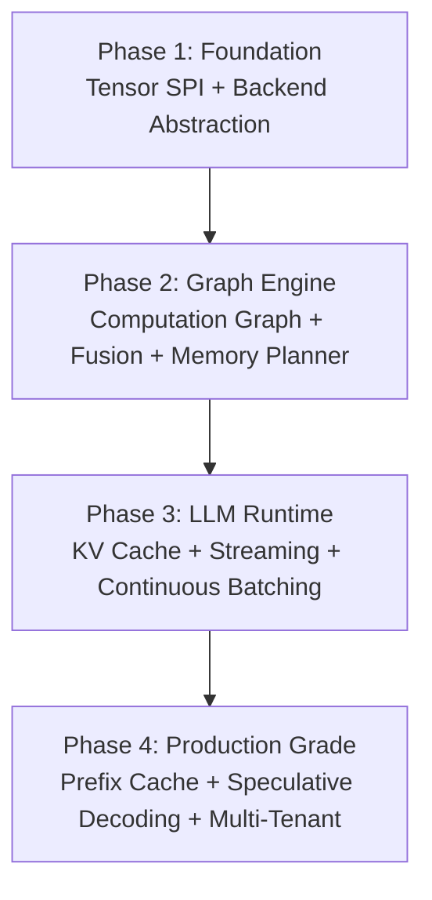

# Gollek Core Runtime Evolution — Implementation Plan

> Evolving Gollek from plugin-based inference into a **production-grade, multi-backend LLM runtime engine**.

Based on the 16 enhancement documents in `gollek/docs/enhancement/next/`, this plan consolidates and sequences the work into 4 deliverable phases. Each phase is self-contained — it compiles, runs, and delivers value before the next begins.

---

## Overview

---

## User Review Required

> [!IMPORTANT]
> This is a **massive architectural evolution** spanning 4 phases. I recommend we tackle **Phase 1 first**, validate it compiles and integrates, then proceed phase-by-phase. Each phase builds on the previous.

> [!WARNING]
> **Phase 4 (Step 13 — Plugin-to-Core refactoring)** will move 13 optimization plugins into the core runtime. This is a breaking change that restructures the Maven module graph. We should discuss the migration strategy before executing.

> [!CAUTION]  
> The existing `LibTorch Tensor` (762 lines, backend-bound) will be **preserved** but wrapped by the new universal `Tensor` interface. No functionality is lost — only abstracted.

---

## Phase 1: Foundation — Tensor SPI + Backend Abstraction
*Maps to: core-step-01, 02, 03, 04*

### Goal
Replace backend-bound Tensor with a **universal, engine-agnostic Tensor interface** + pluggable Backend system.

### New Module
#### [NEW] `gollek/core/gollek-runtime-tensor`

This module contains all foundational runtime primitives:

| File | Purpose |
|------|---------|
| `DType.java` | Enum: FLOAT32, FLOAT16, INT8, INT4, QINT8, QINT4 |
| `Device.java` | Enum: CPU, CUDA, METAL, ROCM |
| `BackendType.java` | Enum: LIBTORCH, GGML, ONNX, LITERT |
| `Tensor.java` | Interface: shape(), dtype(), device(), add(), matmul(), close() |
| `DefaultTensor.java` | Concrete impl wrapping `PooledTensorStorage` |
| `TensorStorage.java` | Interface: handle(), backend(), retain(), release() |
| `NativeTensorStorage.java` | Ref-counted native storage |
| `PooledTensorStorage.java` | Pool-aware storage (returns to pool on release) |
| `TensorKey.java` | Pool index key (shape + dtype + device) |
| `TensorPool.java` | Native memory reuse pool |
| `Backend.java` | Interface: add(), matmul(), relu(), createTensor() |
| `BackendRegistry.java` | Static map of BackendType → Backend |
| `ExecutionContext.java` | Arena-scoped lifecycle + temp tensor tracking |
| `NativeMemory.java` | Backend-dispatched free() |

#### [MODIFY] `gollek-runner-libtorch/core/Tensor.java`
- Keep existing 762-line class as `LibTorchTensor`
- Implement new `tech.kayys.gollek.runtime.tensor.Tensor` interface
- Wrap internal ops to delegate to `LibTorchBackend`

---

## Phase 2: Graph Engine — Computation Graph + Fusion + Memory Planner
*Maps to: core-step-05, 06, 07*

### Goal
Add lazy execution, operator fusion, lifetime-based memory reuse.

### New Module
#### [NEW] `gollek/core/gollek-runtime-graph`

| File | Purpose |
|------|---------|
| `GraphNode.java` | Node: op, inputs, output, lifetime fields |
| `ComputationGraph.java` | DAG of nodes |
| `LazyTensor.java` | Records ops instead of executing |
| `ExecutionPlan.java` | Topologically sorted node list |
| `GraphPlanner.java` | Topological sort + dependency analysis |
| `FusionOptimizer.java` | Pattern-matching fusion (add+relu → add_relu) |
| `LifetimeAnalyzer.java` | Compute [first_use, last_use] per tensor |
| `MemoryBlock.java` | Tracked reusable memory region |
| `GraphMemoryPlanner.java` | Lifetime-aware memory allocator |
| `GraphExecutor.java` | Execute plan with fusion + memory reuse |

---

## Phase 3: LLM Runtime — KV Cache + Streaming + Continuous Batching
*Maps to: core-step-08, 09, 10, 11, 12*

### Goal
Add multi-backend routing, quantization-aware runtime, KV cache, streaming inference, and continuous batching scheduler.

### New Module
#### [NEW] `gollek/core/gollek-runtime-inference`

| Component | Files |
|-----------|-------|
| **Multi-Backend Router** | `BackendRouter.java`, `HeuristicRouter.java`, `CostBasedRouter.java`, `TensorConverter.java`, `ConverterRegistry.java` |
| **Quantization** | `QuantParams.java`, `QuantizedTensor.java`, `Quantizer.java`, `Int8Quantizer.java`, `QuantizationPass.java` |
| **KV Cache** | `KVCache.java`, `KVPage.java`, `PagedKVCache.java` |
| **Streaming** | `TokenStreamer.java`, `StreamingInferenceEngine.java` |
| **Continuous Batching** | `InferenceRequest.java`, `RequestQueue.java`, `Batch.java`, `ContinuousBatchScheduler.java` |
| **Speculative Decoding** | `SpeculativeDecoder.java` |
| **Prefix Cache** | `PrefixKey.java`, `PrefixCache.java` |

---

## Phase 4: Production Grade — Plugin-to-Core + Multi-Tenant Scheduler
*Maps to: core-step-13 (plugin2core), 14*

### Goal
Promote optimization plugins to core runtime modules. Add multi-tenant scheduling with quota-aware resource management.

### Plugin Migration (Step 13)

Move these **13 plugin modules** into the core runtime:

| From Plugin | Target Core Package |
|-------------|-------------------|
| `gollek-plugin-kv-cache` | `gollek-runtime-inference` (KV subsystem) |
| `gollek-plugin-paged-attention` | `gollek-runtime-inference` (attention kernel) |
| `gollek-plugin-prefill-decode` | `gollek-runtime-inference` (PD disaggregation) |
| `gollek-plugin-prompt-cache` | `gollek-runtime-inference` (prefix cache) |
| `gollek-plugin-wait-scheduler` | `gollek-runtime-inference` (scheduler) |
| `gollek-plugin-fa3` | `gollek-runtime-graph` (fusion pass) |
| `gollek-plugin-fa4` | `gollek-runtime-graph` (fusion pass) |
| `gollek-plugin-hybrid-attn` | `gollek-runtime-inference` (attention) |
| `gollek-plugin-elastic-ep` | `gollek-runtime-inference` (elastic EP) |
| `gollek-plugin-evicpress` | `gollek-runtime-inference` (eviction) |
| `gollek-plugin-perfmode` | `gollek-runtime-inference` (perf tuning) |
| `gollek-plugin-qlora` | `gollek-runtime-inference` (quantization) |
| `gollek-plugin-weight-offload` | `gollek-runtime-tensor` (memory mgmt) |

### Multi-Tenant Scheduler (Step 14)

| File | Purpose |
|------|---------|
| `TenantContext.java` | Per-tenant quotas, queues, runtime state |
| `TenantTier.java` | Enum: FREE, PRO, ENTERPRISE |
| `KVQuotaManager.java` | KV block allocation quota enforcement |
| `MultiTenantScheduler.java` | DRR-based fair scheduling |
| `TenantRegistry.java` | Tenant lifecycle management |

---

## Proposed Execution Order

| Step | Phase | What gets built | Key deliverable |
|------|-------|-----------------|-----------------|
| 1 | P1 | `DType`, `Device`, `BackendType` enums | Foundation types |
| 2 | P1 | `Tensor` interface + `TensorStorage` | Universal contract |
| 3 | P1 | `DefaultTensor`, `NativeTensorStorage` | Concrete impl |
| 4 | P1 | `ExecutionContext`, `TensorPool`, `TensorKey` | Memory lifecycle |
| 5 | P1 | `Backend`, `BackendRegistry` | Pluggable execution |
| 6 | P1 | `LibTorchBackend` (wraps existing) | First backend |
| 7 | P2 | `GraphNode`, `ComputationGraph`, `LazyTensor` | Graph recording |
| 8 | P2 | `GraphPlanner`, `ExecutionPlan` | Topological execution |
| 9 | P2 | `FusionOptimizer` | Op fusion |
| 10 | P2 | `LifetimeAnalyzer`, `GraphMemoryPlanner` | Memory reuse |
| 11 | P3 | `BackendRouter`, `TensorConverter` | Multi-backend |
| 12 | P3 | `QuantParams`, `Quantizer`, `QuantizationPass` | INT4/INT8 |
| 13 | P3 | `KVCache`, `PagedKVCache` | KV cache |
| 14 | P3 | `StreamingInferenceEngine` | Token streaming |
| 15 | P3 | `ContinuousBatchScheduler` | vLLM-style batching |
| 16 | P3 | `PrefixCache`, `SpeculativeDecoder` | Advanced optimizations |
| 17 | P4 | Plugin-to-core migration | Unified runtime |
| 18 | P4 | `MultiTenantScheduler` | Production scheduler |

---

## Open Questions

> [!IMPORTANT]
> 1. **Which phase should we start with?** I recommend Phase 1 (Tensor SPI + Backend) as it's the foundation everything depends on.
> 2. **Maven module naming**: Should the new modules be `gollek-runtime-tensor`, `gollek-runtime-graph`, `gollek-runtime-inference`? Or a single `gollek-runtime-core`?
> 3. **Plugin removal timing (Phase 4)**: Should we deprecate the old plugin modules first with a compatibility layer, or do a hard cut?

---

## Verification Plan

### Automated Tests
- Each new interface gets unit tests with mock backends
- `TensorPool` stress test (concurrent acquire/release)
- `GraphExecutor` end-to-end test with fusion verification
- `ContinuousBatchScheduler` throughput test

### Manual Verification
- `mvn clean install -DskipTests` at each phase boundary
- Existing LibTorch inference path must continue working unchanged
- CLI `gollek` command must produce identical output
