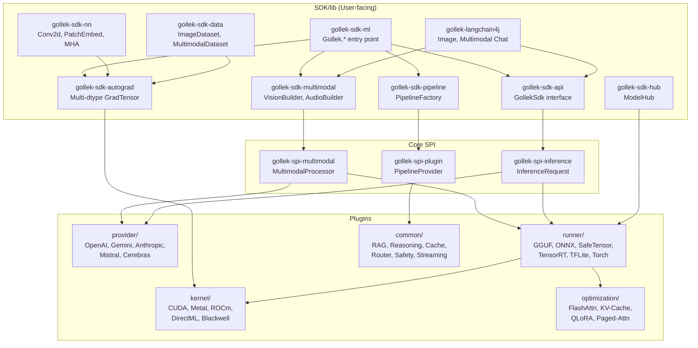

# Gollek SDK/lib Enhancement Plan — Multimodal & Advanced Capabilities

## Executive Summary

The current `gollek/sdk/lib` provides a solid PyTorch-like foundation (tensors, nn.Module, autograd, NLP pipelines, model hub). However, it is **text-only** at every layer, and the rich multimodal SPI already defined in `gollek/core/spi/gollek-spi-multimodal` is **completely disconnected** from the SDK surface. Meanwhile, `gollek/plugins` has a massive ecosystem (5 providers, 6 runners, 5 kernels, 13+ common plugins, 13 optimizations) that the SDK doesn't expose at all.

This plan identifies **7 enhancement areas** to bridge that gap and make the SDK a first-class multimodal AI platform.

---

## Current State Gap Analysis

### What SDK/lib has today

| Module | Content | Limitation |
|---|---|---|
| `gollek-sdk-api` | `GollekSdk.createCompletion(InferenceRequest)` | Single text-only method |
| `gollek-sdk-autograd` | `GradTensor`, `NoGrad`, `Function` | Float-only, no dtype support |
| `gollek-sdk-nn` | Module, Linear, MHA, Transformer layers, loss, optim, Trainer | No vision/audio layers (Conv2d, PatchEmbed, etc.) |
| `gollek-sdk-nlp` | Pipeline, PipelineFactory, PipelineConfig | Text tasks only — no `image-*`, `audio-*`, `video-*` tasks |
| `gollek-sdk-data` | Dataset, DataLoader, TextDataset, CsvDataset | No `ImageDataset`, `AudioDataset`, `MultimodalDataset` |
| `gollek-sdk-hub` | ModelHub — loads safetensors/bin | No multimodal model card awareness, no tokenizer/processor download |
| `gollek-sdk-ml` | `Gollek` entry point — `.pipeline()`, `.tensor()`, `.loadWeights()` | No `.multimodal()`, no `.vision()`, no `.audio()` |
| `gollek-langchain4j` | ChatModel, StreamingChatModel, EmbeddingModel | No `ImageModel`, no multimodal chat support |

### What `gollek/core/spi` already defines (but SDK doesn't use)

- `gollek-spi-multimodal` → `MultimodalContent`, `MultimodalRequest`, `MultimodalResponse`, `ModalityType` (TEXT, IMAGE, AUDIO, VIDEO, DOCUMENT, EMBEDDING, TIME_SERIES), `MultimodalProcessor`, `MultimodalCapability`
- `gollek-spi-inference` → `EmbeddingRequest/Response`, `BatchInferenceRequest`, `BatchScheduler`

### What plugins offer (that SDK should surface)

| Plugin Category | Available | SDK Integration |
|---|---|---|
| **Providers** | OpenAI, Anthropic, Gemini, Mistral, Cerebras | ❌ Not accessible from SDK |
| **Runners** | GGUF, ONNX, SafeTensor, TensorRT, TFLite, LibTorch | ❌ Not routable from SDK |
| **Kernels** | CUDA, Metal, ROCm, DirectML, Blackwell | ❌ SDK autograd doesn't dispatch to them |
| **Common** | RAG, Prompt, Reasoning, Semantic Cache, Model Router, Content Safety, PII Redaction, Streaming, Sampling, MCP | ❌ No SDK pipeline hooks |
| **Optimization** | FlashAttention v3/v4, KV-Cache, Paged Attention, QLoRA, Weight Offload, Prompt Cache | ❌ Not composable from SDK |

---

## Proposed Enhancements

### Enhancement 1: `gollek-sdk-multimodal` — New Module

> [!IMPORTANT]
> This is the highest-priority enhancement. It bridges `gollek-spi-multimodal` to the SDK surface.

#### [NEW] `gollek-sdk-multimodal/`

A new SDK module that gives users a fluent API for multimodal inference:

```java
// Vision: describe an image
var result = Gollek.vision("gemini-2.0-flash")
    .image(Path.of("photo.jpg"))
    .prompt("What's in this image?")
    .generate();

// Audio: transcribe audio
var transcript = Gollek.audio("whisper-large")
    .audioFile(Path.of("meeting.wav"))
    .task("transcription")
    .process();

// Multimodal: mixed input
var response = Gollek.multimodal("gpt-4o")
    .text("Compare these two images")
    .image(Path.of("before.png"))
    .image(Path.of("after.png"))
    .maxTokens(1000)
    .generate();

// Video understanding
var analysis = Gollek.video("gemini-2.0-pro")
    .videoFile(Path.of("clip.mp4"))
    .prompt("Summarize the key events")
    .generate();
```

**Key classes:**
- `MultimodalPipeline` — sits on top of `MultimodalProcessor` SPI
- `VisionBuilder`, `AudioBuilder`, `VideoBuilder` — fluent builders
- `MultimodalPipelineConfig` — extends `PipelineConfig` with modality-aware fields
- `ContentPart` — SDK-level wrapper around `MultimodalContent`

**Wiring to plugins:** ServiceLoader discovers `MultimodalProcessor` implementations provided by `gollek-plugin-openai`, `gollek-plugin-gemini`, etc.

---

### Enhancement 2: Expand `gollek-sdk-nn` with Vision & Audio Layers

Currently nn only has text-oriented layers. For multimodal model building:

#### [MODIFY] `gollek-sdk-nn/`

**New vision layers:**
- `Conv2d` — 2D convolution (fundamental to all vision models)
- `MaxPool2d`, `AvgPool2d` — pooling layers
- `PatchEmbedding` — ViT-style patch tokenization 
- `CLIPVisionEncoder` — reference architecture for vision-language bridging
- `ImageProjection` — projects image features into text embedding space

**New audio layers:**
- `Conv1d` — 1D convolution for audio processing
- `MelSpectrogram` — transforms raw audio to mel spectrograms
- `AudioPatchEmbedding` — Whisper-style audio embedding

**New cross-modal layers:**
- `CrossAttention` — decoder attending to different modality encoder outputs
- `ModalityFusion` — concatenation/gating/attention-based fusion of modality tensors
- `ProjectionHead` — contrastive learning head (CLIP-style)

---

### Enhancement 3: Expand `gollek-sdk-data` for Multimodal Datasets

#### [MODIFY] `gollek-sdk-data/`

**Current state:** Only `Dataset<T>`, `DataLoader<T>`, `TextDataset`, `CsvDataset`.

**New classes:**
- `ImageDataset` — loads images from directories (ImageNet structure or flat)
- `AudioDataset` — loads audio files with waveform/spectrogram extraction
- `ImageTextDataset` — paired image-caption dataset (COCO, CC3M format)
- `MultimodalDataset` — generic multi-part dataset supporting mixed modalities
- `StreamingDataset` — lazy loading for large datasets that don't fit in memory
- `HuggingFaceDataset` — loads datasets from HuggingFace hub format

**Transform system:**
```java
var dataset = new ImageTextDataset(Path.of("coco/"))
    .transform(img -> img.resize(224, 224).normalize())
    .collate(MultimodalCollator::new);

var loader = new DataLoader<>(dataset, 32, true);
```

---

### Enhancement 4: Upgrade `gollek-sdk-api` — Multimodal SDK Contract

#### [MODIFY] `gollek-sdk-api/`

The current `GollekSdk` interface has a single method. Expand it:

```java
public interface GollekSdk {
    // Existing
    InferenceResponse createCompletion(InferenceRequest request);
    
    // NEW: Multimodal
    MultimodalResponse processMultimodal(MultimodalRequest request);
    Multi<MultimodalResponse> processMultimodalStream(MultimodalRequest request);
    
    // NEW: Embeddings
    EmbeddingResponse createEmbedding(EmbeddingRequest request);
    
    // NEW: Capability discovery
    List<MultimodalCapability> capabilities();
    boolean supportsModality(ModalityType type);
}
```

Also add `GollekSdkBuilder` — a fluent facade that auto-resolves providers:

```java
var sdk = GollekSdk.builder()
    .provider("gemini")     // routes to gollek-plugin-gemini
    .apiKey(System.getenv("GEMINI_API_KEY"))
    .model("gemini-2.0-flash")
    .build();
```

---

### Enhancement 5: Plugin-Aware `PipelineFactory` — Register Plugin Tasks

#### [MODIFY] `gollek-sdk-nlp/`

**Current limitation:** `PipelineFactory` hardcodes 3 tasks (`text-generation`, `text-classification`, `embedding`). Custom tasks need manual `register()`.

**Enhancement — auto-discovery via ServiceLoader + plugin SPI:**

```java
// PipelineFactory discovers all Pipeline implementations on the classpath
// Plugins like gollek-plugin-rag, gollek-plugin-reasoning contribute tasks:
//   "rag"                → RagPipeline (from gollek-plugin-rag)
//   "image-generation"   → ImageGenerationPipeline  
//   "image-captioning"   → ImageCaptioningPipeline
//   "speech-to-text"     → SpeechToTextPipeline
//   "text-to-speech"     → TextToSpeechPipeline
//   "document-qa"        → DocumentQAPipeline
//   "video-understanding"→ VideoUnderstandingPipeline
//   "reasoning"          → ReasoningPipeline (from gollek-plugin-reasoning)

var pipeline = Gollek.pipeline("image-captioning", "blip2-opt-2.7b");
String caption = pipeline.process(imageBytes);
```

**New SPI contract:**
```java
// In gollek-spi-plugin or gollek-sdk-nlp
public interface PipelineProvider {
    String task();
    Pipeline<?, ?> create(PipelineConfig config);
    Set<ModalityType> inputModalities();
    Set<ModalityType> outputModalities();
}
```

Rename `gollek-sdk-nlp` → `gollek-sdk-pipeline` (keeping `nlp` as alias) since it now covers all modalities.

---

### Enhancement 6: `gollek-sdk-autograd` — Multi-dtype & Device Dispatch

#### [MODIFY] `gollek-sdk-autograd/`

**Current state:** `GradTensor` is `float[]` only, CPU only.

**Enhancement for multimodal:**
- **DType support:** `FLOAT16`, `BFLOAT16`, `FLOAT32`, `INT8`, `INT4` — essential for quantized models and vision models loading uint8 images
- **Device tags:** Each tensor carries a `Device` (CPU, CUDA, Metal). Arithmetic operations dispatch to the correct kernel plugin via SPI
- **Shape-aware views:** Support `reshape()`, `permute()`, `contiguous()` needed for vision tensor manipulation
- **Image tensor ops:** `GradTensor.fromImage(BufferedImage)` → normalized [C, H, W] tensor

```java
// Load image as tensor
var img = Gollek.imageToTensor(Path.of("cat.jpg"));  // [3, 224, 224]
var features = visionEncoder.forward(img.unsqueeze(0));  // [1, 3, 224, 224]
```

This is how the SDK connects to `plugins/kernel/*` (Metal, CUDA, etc.).

---

### Enhancement 7: Enhance `gollek-langchain4j` for Multimodal

#### [MODIFY] `gollek-langchain4j/`

**Current:** Only `ChatLanguageModel`, `StreamingChatLanguageModel`, `EmbeddingModel`.

**Add:**
- `GollekImageModel implements ImageModel` — for image generation via DALL-E/Imagen plugins
- Multimodal chat support: map `ImageContent`, `AudioContent` LangChain4j message types → `MultimodalContent`
- `GollekScoringModel implements ScoringModel` — reranking via the RAG plugin
- Tool calling support in chat models

---

## Architecture Diagram



---

## Priority & Phasing

| Phase | Enhancement | Effort | Impact |
|---|---|---|---|
| **P0** | **E1** — `gollek-sdk-multimodal` (new module) | Large | 🔴 Critical — bridges SPI to SDK |
| **P0** | **E4** — Expand `gollek-sdk-api` contract | Medium | 🔴 Critical — enables multimodal routing |
| **P1** | **E5** — Plugin-aware `PipelineFactory` | Medium | 🟡 High — auto-discovers plugin tasks |
| **P1** | **E6** — Multi-dtype/device `GradTensor` | Large | 🟡 High — enables kernel dispatch |
| **P2** | **E2** — Vision/Audio nn layers | Large | 🟢 Medium — custom model building |
| **P2** | **E3** — Multimodal datasets | Medium | 🟢 Medium — training/fine-tuning support |
| **P3** | **E7** — LangChain4j multimodal | Small | 🟢 Medium — ecosystem integration |

---

## Open Questions

> [!IMPORTANT]
> **Q1: Module naming** — Should we create `gollek-sdk-multimodal` as a new module, or fold multimodal capabilities into the existing `gollek-sdk-nlp` (renaming it to `gollek-sdk-pipeline`)?

> [!IMPORTANT]
> **Q2: Provider preference** — When `Gollek.vision()` is called, how should the SDK choose between local runners (GGUF/ONNX) and cloud providers (Gemini/OpenAI)? Should there be a default routing policy or should the user always specify?

> [!WARNING]
> **Q3: Breaking changes** — Expanding `GollekSdk` interface adds new methods. Should we add them as `default` methods to preserve backward compatibility, or should we version the interface (e.g., `GollekSdkV2 extends GollekSdk`)?

> [!NOTE]
> **Q4: Scope** — Would you like me to implement all 7 enhancements, or focus on a specific subset (e.g., P0 only: `gollek-sdk-multimodal` + `gollek-sdk-api` expansion)?

---

## Verification Plan

### Automated Tests
- Unit tests for each new class (MultimodalPipeline, VisionBuilder, Conv2d, ImageDataset, etc.)
- Integration tests: `PipelineFactory` auto-discovers plugin-contributed tasks
- `GollekSdk.processMultimodal()` dispatches to mock `MultimodalProcessor`

### Manual Verification
- Build entire sdk/lib: `mvn clean compile -pl gollek/sdk/lib -am`
- Run `Gollek.multimodal()` against a real Gemini provider plugin with image input
