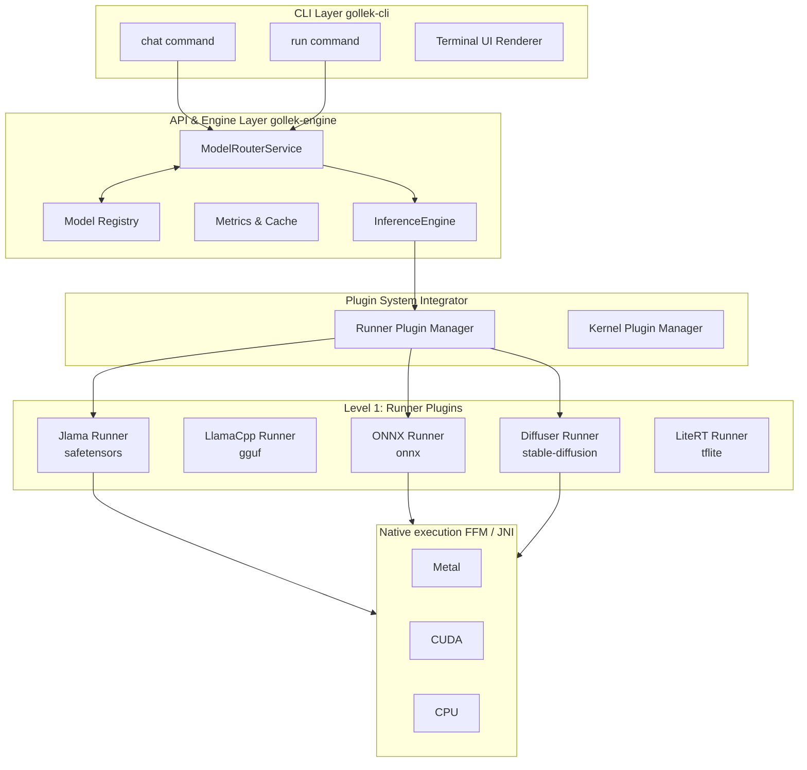
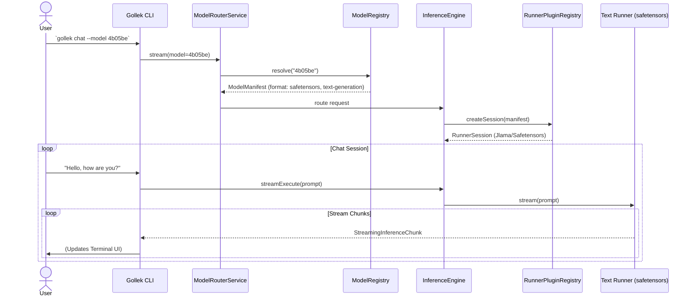
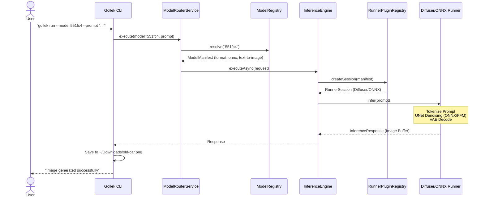
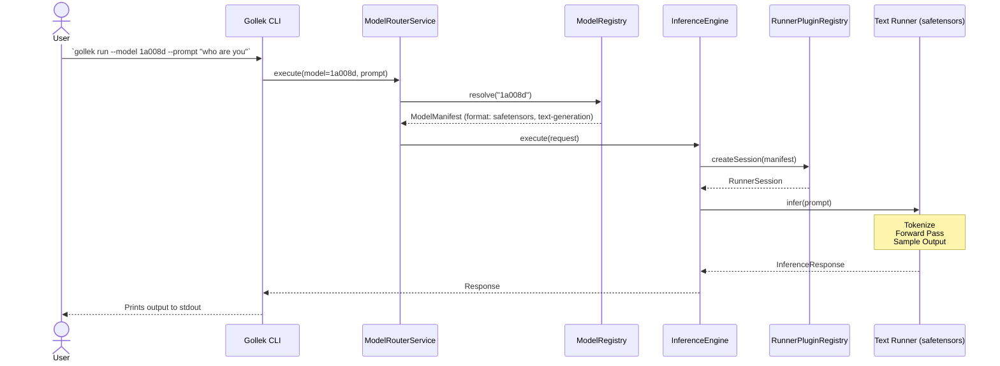

# Gollek Architecture & Request Flow

This document illustrates the internal architecture and flow of the Gollek Inference Engine across various scenarios, using Mermaid diagrams.

## 1. High-Level Architecture

The Gollek platform is built around a pluggable architecture, isolating the CLI and routing layers from the underlying inference formats and native kernels.

---

## 2. Request Flows

### Scenario A: Interactive Chat with a Text Model
**Command:** `gollek chat --model 4b05be` (Model: Qwen2.5-0.5B-Instruct, safetensors)

In this scenario, the CLI establishes an interactive streaming session. The engine routes the `safetensors` model to the corresponding text runner (e.g., Jlama or HuggingFace runner).

### Scenario B: Text-to-Image Generation
**Command:** `gollek run --model 551fc4 --prompt "draw an old car" --output ~/Downloads/old-car.png` (Model: Stable Diffusion v1.4, ONNX)

This is a single-shot execution. The engine identifies that the model requires the ONNX Diffuser runner.

### Scenario C: Single-Shot Text Inference
**Command:** `gollek run --model 1a008d --prompt "who are you"` (Model: Gemma-4-E2B-it, safetensors)

This flow is similar to the chat scenario, but it executes as a single, synchronous operation rather than setting up an interactive loop.

