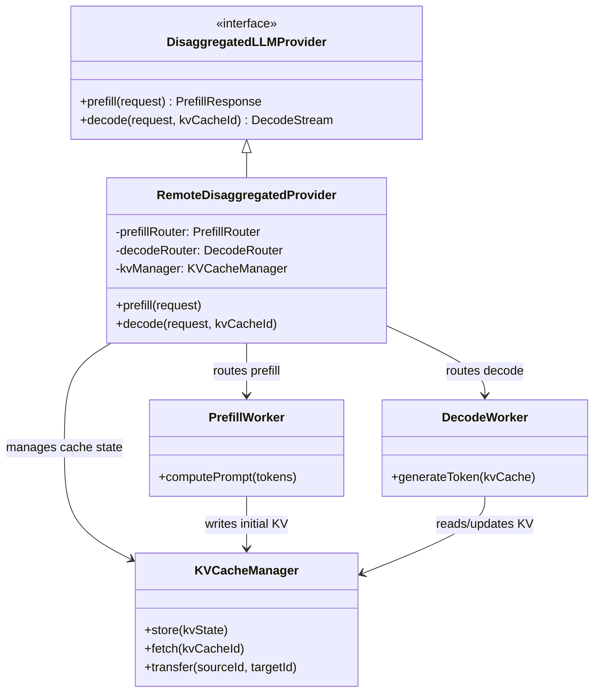
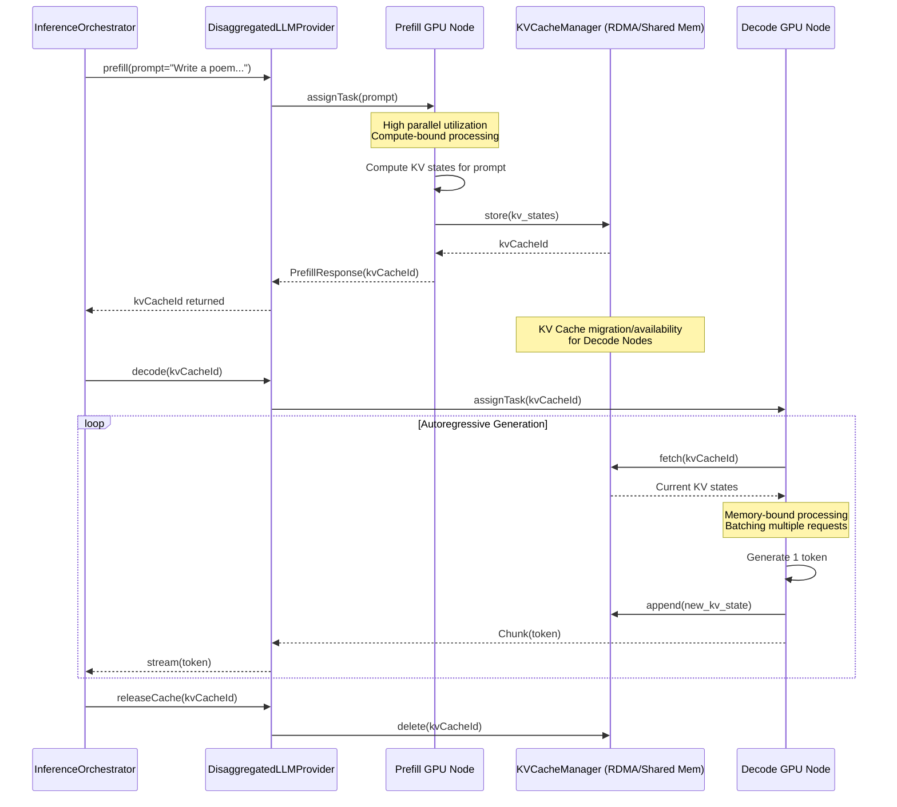

# Gollek Disaggregated LLM Architecture

Disaggregated inference is a high-performance architectural pattern that splits the Large Language Model inference process into two distinct phases: **Prefill** and **Decode**. By decoupling these phases, `gollek-engine` can scale, schedule, and optimize hardware usage independently for each workload.

## 1. Concept: Prefill vs. Decode

- **Prefill (Prompt Processing):** Highly parallel, compute-bound. Processes all input tokens simultaneously to compute the initial Key-Value (KV) cache.
- **Decode (Token Generation):** Sequential, memory-bandwidth-bound. Generates one token at a time, continually fetching and updating the KV cache.

```mermaid
blockDiagram
    block PrefillPhase [Prefill Phase\n(Compute Bound)] {
        PromptTokens[Prompt Tokens] --> ParallelCompute[Parallel Matrix Ops]
        ParallelCompute --> InitialKVCache[Initial KV Cache]
    }
    
    block DecodePhase [Decode Phase\n(Memory Bound)] {
        InitialKVCache --> AutoRegressive[Autoregressive Gen]
        AutoRegressive --> NextToken[Next Token]
        NextToken --> AutoRegressive
    }
```

## 2. Disaggregated Provider Architecture

The `DisaggregatedLLMProvider` acts as the coordinator. It interfaces with specialized worker pools (or network nodes) dedicated specifically to either the Prefill or Decode phase, and manages the KV cache transfer between them.



## 3. Disaggregated Inference Sequence

In a fully disaggregated setup, the prompt might be processed on a "Prefill Node" (e.g., packed with high-TFLOPS GPUs), and then the resulting KV cache is transferred over a high-speed interconnect (e.g., NVLink or RDMA) to a "Decode Node" (e.g., packed with high-HBM GPUs).



## 4. Hardware Scaling Model

Because Prefill and Decode have fundamentally different hardware requirements, disaggregation allows the platform to scale them independently.

```mermaid
flowchart LR
    subgraph Client Requests
        Req1[Request 1]
        Req2[Request 2]
        Req3[Request 3]
    end

    subgraph Disaggregated Routing Layer
        LoadBalancer{DisaggregatedLLMProvider}
    end

    subgraph Prefill Pool
        direction TB
        P1["Prefill Node 1\n(High TFLOPS)"]
        P2["Prefill Node 2\n(High TFLOPS)"]
    end

    subgraph KV Transfer
        RDMA(("High-Speed\nInterconnect"))
    end

    subgraph Decode Pool
        direction TB
        D1["Decode Node 1\n(High Memory BW)"]
        D2["Decode Node 2\n(High Memory BW)"]
        D3["Decode Node 3\n(High Memory BW)"]
        D4["Decode Node 4\n(High Memory BW)"]
    end

    Req1 --> LoadBalancer
    Req2 --> LoadBalancer
    Req3 --> LoadBalancer

    LoadBalancer -->|Prefill Batches| Prefill Pool
    Prefill Pool -->|KV Cache Data| RDMA
    RDMA -->|KV Cache Data| Decode Pool
    LoadBalancer -->|Continuous Decode Scheduling| Decode Pool
```
