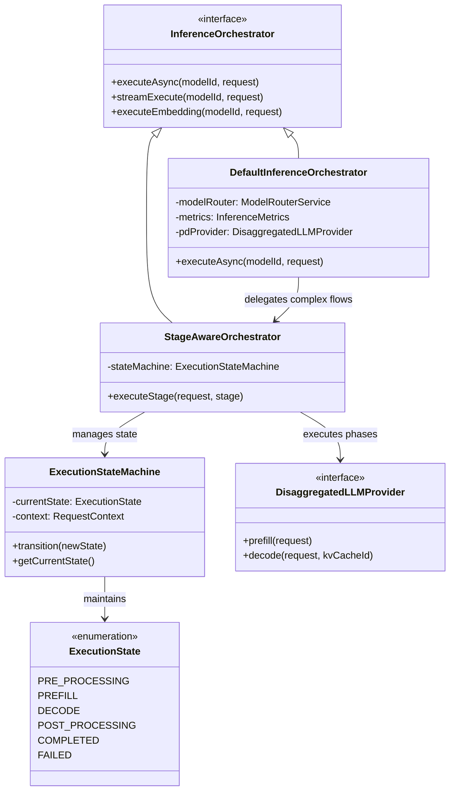
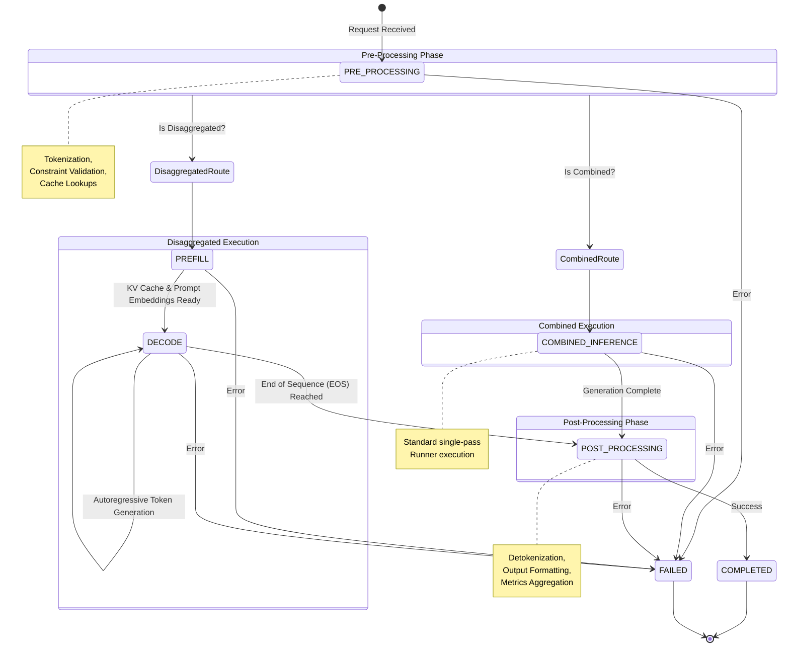
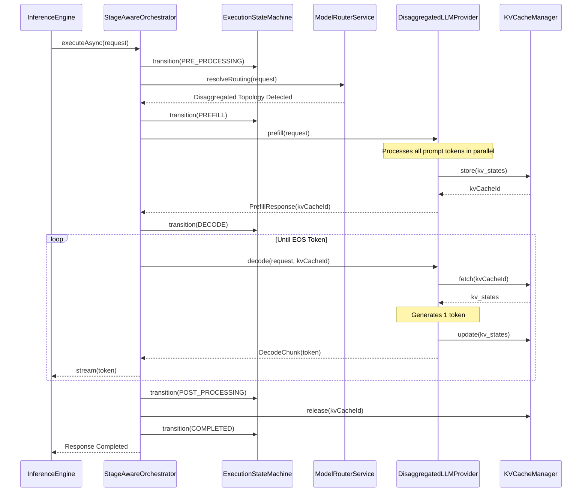
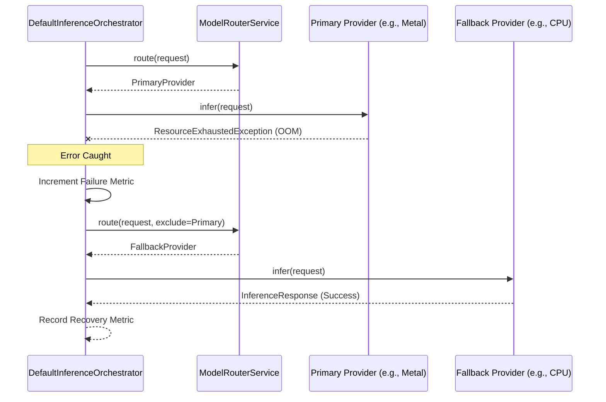

# Gollek Inference Orchestrator Deep Dive

The **Inference Orchestrator** is a critical subsystem within the Gollek Engine (`gollek-engine`). It is responsible for managing the complete lifecycle of inference requests, acting as the operational "brain" that coordinates routing, execution states, disaggregated architectures, and metric collection.

## 1. Orchestrator Component Architecture

The orchestrator abstracts the complexity of different execution strategies (combined vs. disaggregated) and provides a unified interface for the `InferenceEngine` to execute requests.

## 2. Execution State Machine

The `ExecutionStateMachine` strictly controls the transitions between different phases of an inference request, preventing invalid operational sequences.

## 3. Disaggregated Inference Sequence

Disaggregated inference separates the highly parallel "Prefill" phase (processing the prompt) from the memory-bandwidth-bound "Decode" phase (generating tokens one-by-one). The Orchestrator manages this handoff seamlessly.

## 4. Error Handling and Resilience Flow

The Orchestrator incorporates self-healing and resilient execution pathways. If a primary provider or stage fails, the orchestrator handles fallback routing.

