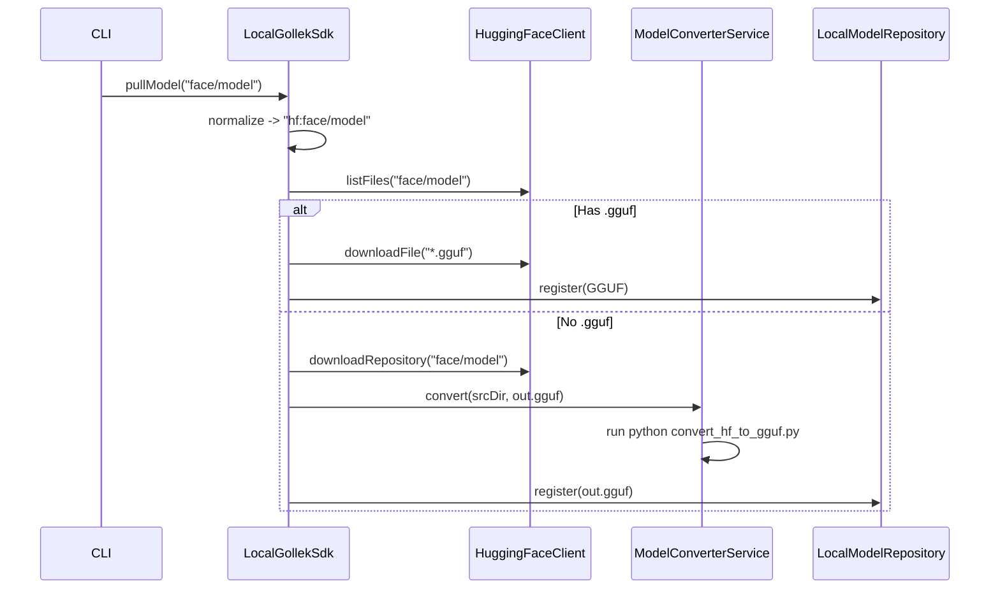

# GGUF Adapter (llama.cpp)

This adapter provides native inference support for GGUF/ggml models via llama.cpp bindings.

## Key Capabilities

* GGUF artifact loading
* CPU/CUDA support
* Token generation via llama.cpp
* Auto-Metal on Apple Silicon (when `ggml-metal` is present)

## Apple Silicon (Metal)

By default, GGUF will auto-enable Metal when running on Apple Silicon and a
`ggml-metal` runtime is found under `~/.gollek/libs/` or `~/.gollek/native-libs/`.

```properties
gguf.provider.gpu.auto-metal=true
gguf.provider.gpu.auto-metal.layers=-1  # -1 = all layers, 0 = auto
```

To disable auto-Metal, set:

```properties
gguf.provider.gpu.auto-metal=false
```

## Request Coalescing

Short-window queueing to smooth bursty traffic. This keeps request order and
does not change outputs, but can improve throughput under load.

```properties
gguf.provider.coalesce.enabled=true
gguf.provider.coalesce.window-ms=3
gguf.provider.coalesce.max-batch=8
gguf.provider.coalesce.max-queue=64
gguf.provider.coalesce.seq-max=1
```

Set `gguf.provider.coalesce.seq-max > 1` to enable multi-sequence micro-batching.
Per-request overrides:
* `gguf.coalesce=false` to bypass coalescing
* `gguf.session.persist=true` automatically bypasses coalescing

Metrics:
* `gollek.gguf.coalesce.seq.max`
* `gollek.gguf.coalesce.seq.avg`
* `gollek.gguf.coalesce.seq.total`
* `gollek.gguf.request.duration`
* `gollek.gguf.prompt.duration`
* `gollek.gguf.decode.duration`
* `gollek.gguf.ttft`
* `gollek.gguf.tpot`
* `gollek.gguf.tokens.input`
* `gollek.gguf.tokens.output`

## Optimization Modules (Detection Only)

If optimization extensions are on the classpath, GGUF will advertise them in
provider features (capabilities) so the engine/UI can reflect availability:

* `prompt_cache`
* `paged_kv_cache`
* `paged_attention`
* `prefill_decode_disagg`
* `hybrid_attention`
* `flash_attention4`

These flags indicate availability, not active usage, because GGUF inference
uses the llama.cpp runtime instead of Gollek kernel runners.

### Compatibility Summary

| Optimization Module | GGUF (llama.cpp) | Kernel Runners |
|---------------------|-----------------|----------------|
| `gollek-ext-prompt-cache` | Detectable only | Supported |
| `gollek-ext-kv-cache` | Detectable only | Supported |
| `gollek-ext-paged-attention` | Detectable only | Supported |
| `gollek-ext-prefilldecode` | Detectable only | Supported |
| `gollek-ext-hybridattn` | Detectable only | Supported |
| `gollek-ext-fa3` | Detectable only | Supported |
| `gollek-ext-fa4` | Detectable only | Supported |

## Context Window Behavior

If an input prompt exceeds `gguf.provider.max-context-tokens`, the runner
truncates the prompt to the last `max-context-tokens` before inference.
This applies to both single-sequence and multi-sequence paths.
If `max_tokens` would overflow the remaining context window, it is clamped
to fit within `max-context-tokens`.

## Key Paths

* Binding: `inference-gollek/adapter/gollek-ext-runner-gguf/src/main/java/tech/kayys/gollek/inference/gguf/LlamaCppBinding.java`
* Runner: `inference-gollek/adapter/gollek-ext-runner-gguf/src/main/java/tech/kayys/gollek/inference/gguf/LlamaCppRunner.java`
* Config: `inference-gollek/adapter/gollek-ext-runner-gguf/src/main/java/tech/kayys/gollek/inference/gguf/GGUFConfig.java`


**Responsibility**:
- Locate `convert_hf_to_gguf.py` script.
- Execute python script to convert HF model directory to GGUF file.
- Handle process execution and logging.

### 2. LocalGollekSdk
**Location**: `sdk/gollek-sdk-java-local/src/main/java/tech/kayys/gollek/sdk/local/LocalGollekSdk.java`

**Changes**:
- **Default Provider**: Change default to `gguf`.
- **`pullModel` Logic**:
  - Default prefix `hf:` if none specified.
  - If `hf:`:
    - Check for `*.gguf` files in repo via `HuggingFaceClient`.
    - **Scenario A (GGUF exists)**: Download GGUF file(s).
    - **Scenario B (No GGUF)**: 
      - Download full model (safetensors/bin + json/tokenizer).
      - Call `ModelConverterService.convert()`.
      - Register resulting GGUF in `LocalModelRepository`.

### 3. HuggingFaceClient
**Location**: `repository/gollek-model-repo-hf/src/main/java/tech/kayys/gollek/model/repo/hf/HuggingFaceClient.java`

**Changes**:
- Add `listFiles(modelId)` method to check repo contents.
- Add `downloadRepository(modelId, targetDir)` for full model download.

## Detailed Flow



## Prerequisite Checks
- Python environment with dependencies (assume user has `python3` and `pip` installed, or use venv from `llama-cpp` vendor dir).
- `llama.cpp` scripts availability.

## Verification
- Pull an existing GGUF model (e.g. `TheBloke/Llama-2-7B-Chat-GGUF`).
- Pull a non-GGUF model (e.g. `tiny-random-llama`).
- Run inference with `gguf` provider.


model fetching.

## Verification Instructions

### 1. Build the Modules
Run the following command to build the updated modules and resolve new dependencies:

```bash
mvn clean install -pl repository/gollek-model-repo-hf,inference/format/gguf/gollek-ext-runner-gguf,sdk/gollek-sdk-java-local -am -DskipTests
```

### 2. Verify Default Provider
Run a simple inference command without specifying provider (should default to GGUF):

```bash
java -jar ui/gollek-cli/target/quarkus-app/quarkus-run.jar run --model TheBloke/Llama-2-7B-Chat-GGUF --prompt "Hello"
```
Expect logs indicating `Pulling model: hf:TheBloke/Llama-2-7B-Chat-GGUF` and downloading `.gguf` file.

### 3. Verify Auto-Conversion
Run a command for a non-GGUF model:

```bash
java -jar ui/gollek-cli/target/quarkus-app/quarkus-run.jar run --model tiny-random-llama --prompt "Hello"
```
Expect logs indicating:
- "No GGUF file found..."
- "Downloading for conversion..."
- "Converting model to ..."
- Successful inference after conversion.

### 4. Verify Explicit Provider
Run a command forcing `ollama` provider to ensure backward compatibility:

```bash
java -jar ui/gollek-cli/target/quarkus-app/quarkus-run.jar run --model llama2 --provider ollama --prompt "Hello"
```

## Development
```bash
export JAVA_HOME=/opt/homebrew/Cellar/openjdk/25.0.2/libexec/openjdk.jdk/Contents/Home
mvn clean compile -f inference-gollek/pom.xml -pl :gollek-ext-runner-gguf,:gollek-gguf-converter -am
```
