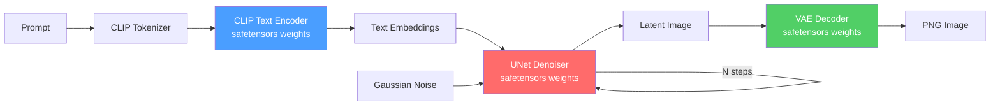

> The ONNX Runtime approach requires either (a) pre-converted ONNX models or (b) a conversion step. Since the user had it "working in a few seconds before", the best path is a **pure-Java runner** that reads safetensor weights directly — no conversion needed.

##  Solution: `StableDiffusionNativeRunner`

A fully native Java implementation that:
1. **Reads weights directly** from `.safetensors` files using the existing `SafetensorShardLoader` + `SafetensorFFMLoader`
2. **Performs inference in pure Java** using FFM (Foreign Function & Memory) for SIMD-optimized math
3. **No external native dependency** — no ONNX Runtime library needed
4. **Integrates with existing gollek modules** — quantizer, optimization plugins

## Architecture

### Pipeline Components

| Component | Weights File | Config | Architecture |
|-----------|-------------|--------|--------------|
| CLIP Text Encoder | `text_encoder/model.safetensors` | `text_encoder/config.json` | CLIPTextModel (12 transformer layers) |
| UNet | `unet/diffusion_pytorch_model.safetensors` | `unet/config.json` | UNet2DConditionModel |
| VAE Decoder | `vae/diffusion_pytorch_model.safetensors` | `vae/config.json` | AutoencoderKL (decoder half) |
| Tokenizer | `tokenizer/vocab.json` + `merges.txt` | — | BPE (CLIP-style) |
| Scheduler | — | `scheduler/scheduler_config.json` | PNDMScheduler / DDIM |