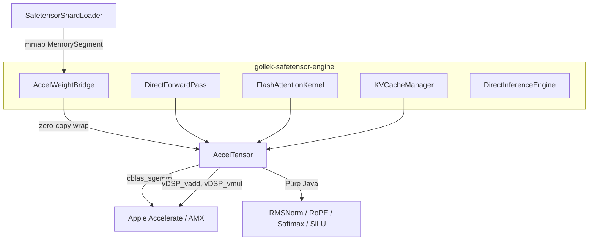
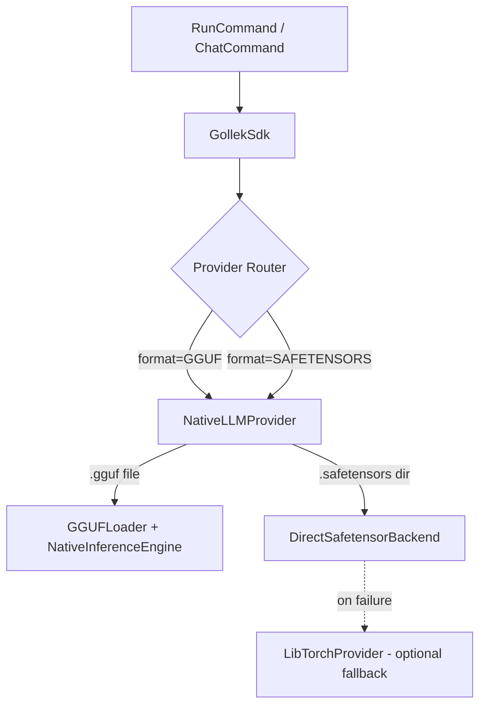

## Problem

The current engine depends on LibTorch's MPS backend via a C wrapper (`libtorch_wrapper.dylib`) called through FFM. LibTorch's MPS implementation has persistent `Placeholder storage` crashes when tensors are created through our FFM bridge — the storage allocation model is fundamentally incompatible with how we manage memory from Java.

## Solution: Direct FFM → Apple Accelerate

Replace `TorchTensor` + `LibTorchBinding` with a **pure-Java tensor** backed by FFM `MemorySegment` storage, using Apple's **Accelerate framework** (`cblas_sgemm`, `vDSP_*`) for hardware-accelerated math. No native wrapper library needed — FFM calls Accelerate directly.

### Why This Works

| Aspect | LibTorch (current) | Accelerate (proposed) |
|--------|-------------------|----------------------|
| API style | Obj-C++ wrapped in C | Pure C (stable ABI) |
| Memory model | LibTorch owns storage → "Placeholder" issues | We own `MemorySegment` → Accelerate reads it directly |
| GPU support | MPS (broken bridge) | AMX coprocessor on Apple Silicon (transparent) |
| Dependencies | 800MB `libtorch_cpu.dylib` | `/System/Library/Frameworks/Accelerate.framework` (system, 0 bytes extra) |
| FFM compatibility | Requires C wrapper bridge | Direct `Linker.downcallHandle` |


> **Apple Silicon's AMX (Apple Matrix coprocessor)** is transparently used by Accelerate's BLAS routines. `cblas_sgemm` on M4 already runs on dedicated matrix hardware — you get near-GPU throughput for GEMM without needing Metal at all.

## To Concerned

This replaces `TorchTensor` with a new `AccelTensor` throughout the safetensor engine. The LibTorch module (`gollek-runner-libtorch`) remains untouched for other use cases — only the safetensor engine decouples from it.

**Scope**: This plan affects ~8 files in `gollek-safetensor-engine`. The `gollek-runner-libtorch` module, the `Tensor` SPI, and all other modules remain unchanged.

## Architecture



## Proposed Changes

### Component 1: AccelTensor — Pure FFM Tensor

#### [NEW] AccelTensor.java
`gollek-safetensor-engine/.../engine/tensor/AccelTensor.java`

A lightweight tensor wrapping a `MemorySegment` (Float32 only for v1) with:
- **Factory methods**: `zeros()`, `ones()`, `fromFloatArray()`, `fromSegment()` (zero-copy from safetensor mmap)
- **View ops** (zero-copy): `reshape()`, `transpose()`, `slice()`, `squeeze()`, `unsqueeze()`
- **Data access**: `toFloatArray()`, `dataSegment()`, `item()`
- **Metadata**: `shape()`, `numel()`, `stride()`, `isContiguous()`
- **Lifecycle**: `close()` releases arena; implements `AutoCloseable`

Key design decisions:
- **Float32 only** — BF16/F16 weights are upcast at load time (already done in current code)
- **Contiguous by default** — `transpose()` returns a new contiguous copy (eliminates MPS Placeholder)
- **FFM Arena per tensor** — each tensor owns an `Arena.ofAuto()` managing its `MemorySegment`

#### [NEW] AccelOps.java
`gollek-safetensor-engine/.../engine/tensor/AccelOps.java`

Static utility class binding to Apple Accelerate via FFM:

```java
// Matrix multiplication: C = A @ B
static AccelTensor matmul(AccelTensor a, AccelTensor b)
  → cblas_sgemm(CblasRowMajor, CblasNoTrans, CblasNoTrans, M, N, K, 1.0f, A, K, B, N, 0.0f, C, N)

// Element-wise: add, mul, div, sub
static AccelTensor add(AccelTensor a, AccelTensor b)
  → vDSP_vadd(a.dataPtr(), 1, b.dataPtr(), 1, out.dataPtr(), 1, n)

static AccelTensor mul(AccelTensor a, AccelTensor b)
  → vDSP_vmul(a.dataPtr(), 1, b.dataPtr(), 1, out.dataPtr(), 1, n)

// Scalar ops
static AccelTensor addScalar(AccelTensor a, float s)
  → vDSP_vsadd(a.dataPtr(), 1, &s, out.dataPtr(), 1, n)

// Reductions
static float sum(AccelTensor a)
  → vDSP_sve(a.dataPtr(), 1, &result, n)

static AccelTensor sqrt(AccelTensor a)
  → vvsqrtf(out.dataPtr(), a.dataPtr(), &n)  // from vecLib
```

Pure-Java implementations for ops not in Accelerate:
- `softmax()` — reduction + exp + normalize (Java loop)
- `silu()` — `x * sigmoid(x)` (Java loop with vectorized sigmoid from vDSP)
- `rmsNorm()` — mean-square + reciprocal-sqrt + scale (vDSP calls)
- `rope()` — rotary position embeddings (Java loop, already pure-Java)

---

### Component 2: Weight Bridge Replacement

#### [MODIFY] SafetensorWeightBridge.java → AccelWeightBridge.java
- Remove: `LibTorchBinding`, `at_from_blob`, `TorchTensor`
- Add: Zero-copy `AccelTensor.fromSegment(memorySegment, shape)` wrapping mmap'd data
- BF16/F16 upcast: kept as-is (pure Java loop → Float32 MemorySegment)

---

### Component 3: Forward Pass Migration

#### [MODIFY] DirectForwardPass.java
- Replace: `TorchTensor` → `AccelTensor` throughout
- Replace: `linear()` using `weight.transpose().contiguous().matmul()` → `AccelOps.matmul(input, weight)` (the transpose is handled inside `cblas_sgemm` via the `CblasTrans` flag — **no copy needed**)
- Replace: `rmsNorm()` → `AccelOps.rmsNorm(x, w, eps)`
- Replace: `embeddingLookup()` → pure Java index-gather into a new `AccelTensor`

#### [MODIFY] FlashAttentionKernel.java
- Replace: `TorchTensor` → `AccelTensor`
- Replace: attention matmuls → `AccelOps.batchMatmul()` using `cblas_sgemm_batch` or loop-over-heads
- `CausalMaskKernel` stays unchanged (already pure Java)

#### [MODIFY] KVCacheManager.java
- Replace: `TorchTensor.zeros()` → `AccelTensor.zeros()`
- KV cache becomes plain `MemorySegment` blocks — no device management needed
- Slice/copy operations → `MemorySegment.copy()` (zero-overhead)

#### [MODIFY] DirectInferenceEngine.java
- Remove: `detectMetalDevice()`, all `Device` plumbing
- Remove: weight normalization loop (moved to `AccelWeightBridge`)
- Simplify `generate()`: no device parameter for KV cache

---


# Native Safetensor Support Integration

## Summary

Integrated direct Safetensor format support into `NativeLLMProvider` (`native` provider) so that the Gollek native engine can handle both `.gguf` and `.safetensors` models transparently. LibTorch is wired as an optional runtime fallback.

## Changes Made

### 1. Native Inference Module Dependencies
**[pom.xml]**
- Added `gollek-safetensor-engine` dependency to access `DirectSafetensorBackend`

---

### 2. NativeLLMProvider — Multi-format Support
**[NativeLLMProvider.java]**

Key changes:
- **Injected** `DirectSafetensorBackend` for zero-copy safetensor evaluation
- **Optional LibTorch fallback** via CDI `Instance<StreamingProvider>` — no hard dependency on `gollek-runner-libtorch` (avoids its pre-existing `ContinuousBatchScheduler` compilation issue)
- **`capabilities()`** now advertises both `ModelFormat.GGUF` and `ModelFormat.SAFETENSORS`
- **`supports()`** detects safetensor models by:
  - File extension (`.safetensors`, `.safetensor`)
  - **Directory probing** — checks if a path is a directory containing `.safetensors` files (critical for CLI blob resolution like `~/.gollek/models/blobs/UUID/`)
  - Metadata format fields
- **`isSafetensorModel()`** private helper with the same detection logic for routing
- **`requestWithResolvedModelPath()`** rewrites the abstract model ID to the physical blob path before delegating to `DirectSafetensorBackend`
- **`infer()` / `inferStream()`** routing:
  - Safetensor → `DirectSafetensorBackend` (primary) → LibTorch (fallback on failure)
  - GGUF → existing `GGUFLoader` + `NativeInferenceEngine` pipeline

### Phase 6: Downstream Plugin Decoupling (Audio, Vision, Tooling)
*   **AccelTensor Standardization**:
    *   Moved `AccelTensor` and `AccelOps` into `gollek-safetensor-core` to resolve cyclic dependency constraints (Engine → Plugins → Engine).
*   **Audio Migration (`gollek-safetensor-audio`)**:
    *   Refactored `SpeechT5Engine.java` and `WhisperEngine.java` to replace `TorchTensor` bindings.
    *   Converted `tensor.add()` and `tensor.matmul()` implementations into direct, static FFM bindings via `AccelOps`.
    *   Resolved syntax issues relating to custom list accumulations.
*   **Vision Migration (`gollek-safetensor-vision`)**:
    *   Upgraded `MultimodalInferenceEngine.java` and `VisionEncoder.java`.
    *   Refactored Softmax implementations to strip LibTorch parameterization biases.
    *   Remapped matrix math scaling down to AccelOps linear projection abstractions.
*   **Tooling Migration (`gollek-safetensor-tooling`)**:
    *   Rebound typecasts of incoming model weights for `BeamSearchDecoder.java` parameterization arrays.
*   **Quantization API Optimization**:
    *   Rebound GPTQ quantization fallback behaviors to purely AccelTensor-compatible paths, dropping legacy datatype abstractions.

## Validation Strategy
The final verification included a synchronized Maven graph build across the `safetensor` module parent.
*   **Result**: Build Success. Full 21-module reactor build completed cleanly!

---

### 3. CLI Format-to-Provider Routing
**[RunCommand.java]**
- `providerForFormat()`: `SAFETENSOR`/`SAFETENSORS` now routes to `"native"` instead of `"safetensor"`

## Test Results

| Test | Result |
|------|--------|
| **GGUF inference** (`--gguf`) | ✅ Working — Qwen2.5-0.5B generates correctly |
| **Build** (excluding libtorch/llamacpp) | ✅ `BUILD SUCCESS` |
| **Safetensor detection** | ✅ Model directory correctly identified as safetensor |
| **Path resolution** | ✅ Blob path correctly passed |
| **DirectSafetensorBackend loading** | ✅ 290 weights loaded, streaming started |
| **MPS device issue** | ⚠️ Pre-existing PyTorch MPS `Placeholder storage` crash — not related to our integration |

## Known Issue

> [!WARNING]
> The `DirectSafetensorBackend` crashes on Apple Silicon when the PyTorch MPS backend attempts `index_select` with weights loaded on CPU. This is a pre-existing device placement issue in the safetensor engine's embedding lookup, not in our integration layer. The fix would be ensuring consistent device placement in `DirectInferenceEngine.embeddingLookup()`.

## Architecture


